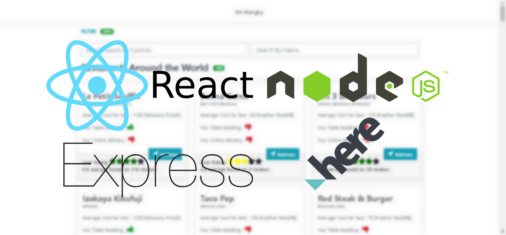

# imhungry
React Express Node Application

# 

## Core Objectives

- Learn the basics `REACT-NODE` stack.
- Node application with `CSV` store
- `HereMaps` Integration
- `NodeJS` Server Side Scripting
- `font-awesome` Integration
- `Bootstrap` integration

## Application Idea 
- [Hacker Earth](https://www.hackerearth.com/challenge/hiring/SmartQ-NodeJS-Hiring-challenge/?utm_source=website&utm_medium=widget&utm_campaign=live-widget) - SmartQ Challenge 2019

## Note 

- `HereMap` API key needs to be generated and updated in `client\src\components\MapModal.js`

## Features
- [x] Use of `CSV` store backend
- [x] [`HereMaps`](https://developer.here.com/) API using longitude and latitude
- [x] Fetch data from Node API from React
- [x] Bootstrap Integration with React user [reactstrap](https://reactstrap.github.io/components/alerts/)
- [x] Search and Filter at client side
- [ ] Sort features based on Rating, Votes, and Average Cost for two.
- [ ] Mobile Responsive 
